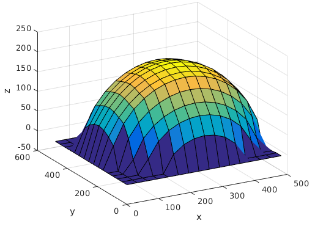
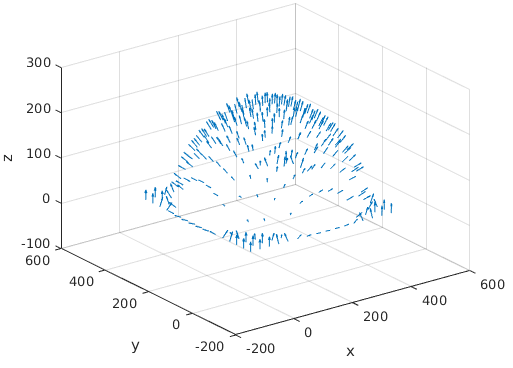
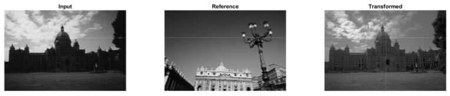
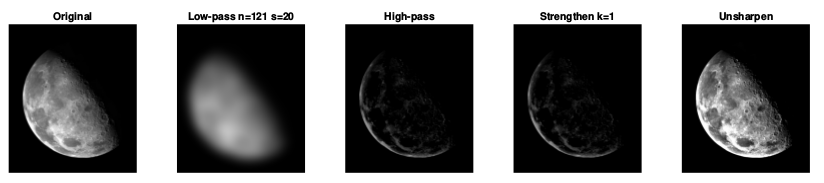
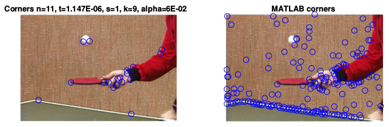
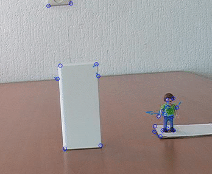
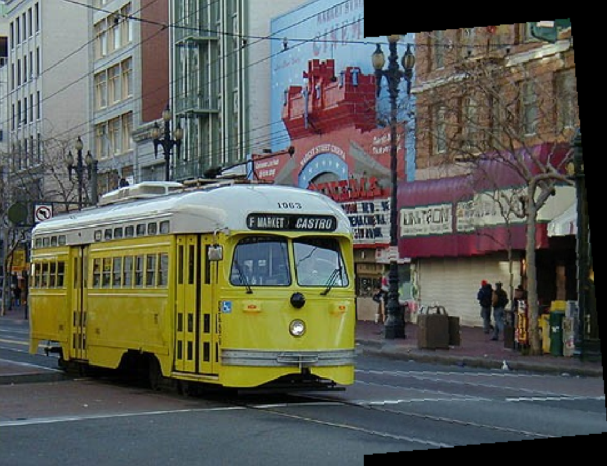
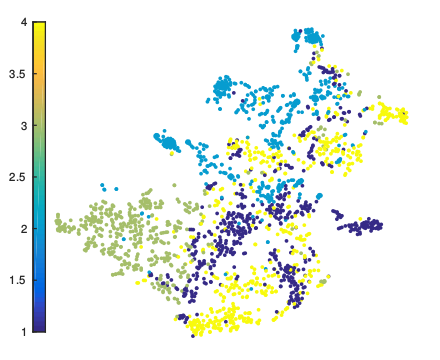
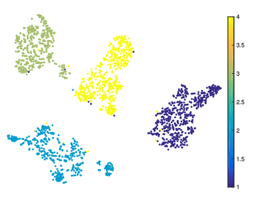

# Computer Vision 1

[](LICENSE)

## Description

Code for the labs of the [Computer Vision 1](http://coursecatalogue.uva.nl/xmlpages/page/2016-2017-en/search-course/course/27164) course at the University of Amsterdam.

### Lab 1 - Photometric Stereo and Color Spaces
- [Report](lab1/report.pdf)

Reconstructed Surface            |  Reconstructed Normals
:-------------------------:|:-------------------------:
  |  


### Lab 2 - Image Filtering, Histogram Matching, Gradient and Unsharp Kernels
- [Report](lab1/report.pdf)

<p align="center">
  <br />
  <i>Histogram Matching </i>
</p>

<p align="center">
  <br />
  <i>Unsharp Mask</i>
</p>

### Lab 3 - Corner Detection, Optical Flow and Tracking
- [Report](lab3/report.pdf)

<p align="center">
  <br />
  <i>Corner Detection - Left: Our - Right: MATLAB</i>
</p>

<p align="center">
  <br />
  <i>Tracking</i>
</p>

### Lab 4 - Image Alignment and Stitching
- [Report](lab4/report.pdf)

<p align="center">
  <br />
  <i>Image Stitching</i>
</p>

### Final Project - Multi-Class Image Classification: BoW and CNNs
- [Report](project/report.pdf)

Pre-trained Features           |  Fine-tuned Features
:-------------------------:|:-------------------------:
  |  


## Testing
Refer to each lab and run the MATLAB code as follows:
``` 
matlab main.m
```

## Dependencies
- MATLAB 2016b

## Contributors

- [Dana Kianfar](https://github.com/danakianfar)
- [Jose Gallego](https://github.com/jgalle29)

## Copyright

Copyright © 2017 Dana Kianfar and Jose Gallego.

<p align="justify">
This project is distributed under the <a href="LICENSE">MIT license</a>. This was code as part of the Computer Vision 1 course taught by Theo Gevers at the University of Amsterdam. Please follow the <a href="http://student.uva.nl/en/az/content/plagiarism-and-fraud/plagiarism-and-fraud.html">UvA regulations governing Fraud and Plagiarism</a> in case you are a student.
</p>
